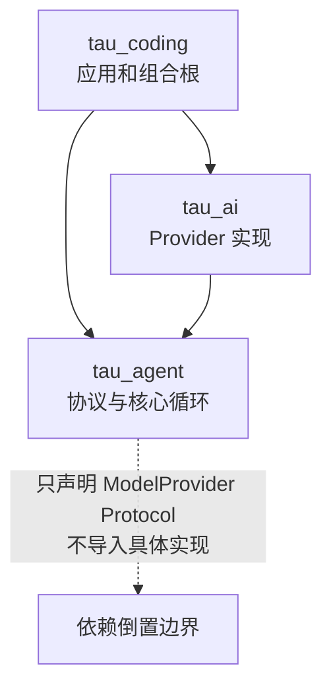
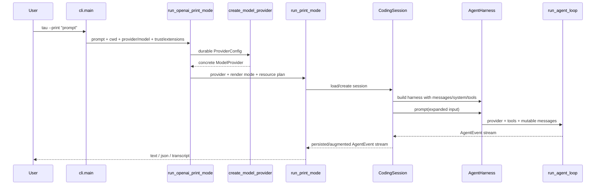

---
tags:
  - Agent/Coding-Agent
  - 源码分析/Tau
aliases:
  - Tau 三层架构
  - Tau 启动链路
source_type: source-analysis
status: complete
---

# 02 - 三层架构、依赖方向与启动链路

## 三层的职责，而非简单调用箭头

README 写的是：

```text
tau_coding → tau_agent → tau_ai
```

这个图适合描述“应用发起 Agent、Agent 使用模型”的概念流程，但**不适合当作 Python import 依赖图**。

### 真实依赖关系



### 源码事实

- [`tau_agent/provider.py`](https://github.com/huggingface/tau/blob/15f77f77acfb20608c3a86638aabf59bd614755d/src/tau_agent/provider.py#L19-L37) 定义 `ModelProvider` Protocol。
- `tau_agent` 的 loop/harness 只依赖这个 Protocol 和自身消息/工具类型。
- `tau_ai` 的 adapter 导入 `tau_agent` 的 message、tool、provider event contract 来实现协议。
- [`tau_coding/provider_runtime.py`](https://github.com/huggingface/tau/blob/15f77f77acfb20608c3a86638aabf59bd614755d/src/tau_coding/provider_runtime.py#L58-L187) 同时认识配置与具体 adapter，是组合根。

> [!important] 架构含义
> 核心层拥有抽象，外围 provider 实现抽象，最外层应用选择实现。这比让 loop 直接 `if provider == "openai"` 更容易测试和扩展。

## 每层到底拥有什么

| 层 | 拥有 | 明确不应拥有 |
|---|---|---|
| `tau_agent` | canonical message、provider/agent event、tool contract、loop、harness、portable session primitives | OAuth、配置文件、Typer、Textual、Rich、本地资源路径 |
| `tau_ai` | HTTP payload/stream parser、provider-specific retry/auth header、OpenAI/Anthropic/Google/Mistral adapter | coding tools、session UI、slash commands、项目资源 |
| `tau_coding` | CLI/TUI、provider catalog、credentials、coding tools、system prompt、skills、extensions、session orchestration | 不应反向污染 portable core |

## CLI 入口

### 1. 安装命令映射

[`pyproject.toml`](https://github.com/huggingface/tau/blob/15f77f77acfb20608c3a86638aabf59bd614755d/pyproject.toml#L27-L29)：

```toml
[project.scripts]
tau = "tau_coding.cli:app"
```

模块导入时创建 Typer `app`，主 callback 为 `main()`。

### 2. `main()` 先做模式路由

[`cli.py#L313-L477`](https://github.com/huggingface/tau/blob/15f77f77acfb20608c3a86638aabf59bd614755d/src/tau_coding/cli.py#L313-L477) 处理：

- version、sessions、export、providers、setup；
- 参数互斥与迁移错误；
- cwd、session、provider、system prompt、extensions、project trust；
- 无 `--print` 时进入 `run_openai_tui()`；
- print mode 进入 `run_openai_print_mode()`。

## Print mode 的完整启动链



### 关键函数

1. `run_openai_print_mode()`：加载 provider catalog/config，做 trust 决策，构造 provider 和 session。
2. `create_model_provider()`：按 config 类型创建 Anthropic、OpenAI Codex 或 OpenAI-compatible；后者再按 `api` 分流到 Google/Mistral/Anthropic protocol。
3. `run_print_mode()`：选择 renderer，加载或创建 `CodingSession`，遍历 `session.prompt()` 的事件。
4. `CodingSession.load()`：读取 JSONL、恢复 active leaf、模型/思考级别、消息与资源。
5. `CodingSession.prompt()`：处理 slash command、prompt template/skill/input hook、自动压缩、调用 Harness、持久化事件。

## TUI 启动链的差异

`main()` → `run_openai_tui()` → `run_tui_app()`。TUI 仍然使用 `CodingSession`，差异在于：

- Textual app 持有输入、窗口化 transcript、sidebar、modal/picker 等 UI 状态；
- adapter 消费 `AgentEvent` 并投影为 `TuiState`；
- 用户可在运行中 steering、follow-up、cancel；
- UI 可以调用 command registry 和 extension component seam；
- 核心 loop 不导入任何 Textual 类型。

## `CodingSession` 为什么是应用层枢纽

`AgentHarness` 构造参数只有 provider、model、system、tools、max_turns、queue policy 和 tool hooks。它不知道：

- 系统提示词从哪几个文件来；
- project trust 是否允许读取 `.agents/`；
- session 写到哪个路径；
- `/compact`、`/tree`、`/model` 如何工作；
- extensions 注册了哪些命令；
- TUI 如何渲染 tool diff。

这些全部在 `CodingSession` 及其协作者中解决。因此 README 中：

```text
AgentHarness = reusable brain
CodingSession = coding-agent environment
TUI = one possible frontend
```

不是宣传语，而是可从 import 和构造参数验证的边界。

## 依赖倒置的实际收益

### 可测试

loop 测试注入 fake provider、fake tools，不需要网络、OAuth 或 TUI。

### 可替换 Provider

新模型协议只需满足 `ModelProvider.stream_response()` 并转换为统一 assistant events；loop 不变。

### 可替换 Frontend

同一事件可由：

- text renderer；
- newline-delimited JSON；
- transcript renderer；
- Textual TUI；
- 自定义 frontend

消费。frontend 无需重写 Agent 控制流。

## 当前结构中的压力点

### 分析与判断

1. **组合根分散。** CLI、TUI app、CodingSession 和 reload/extension runtime 都承担一部分装配职责，追踪一次完整启动需跨多个文件。
2. **`CodingSession` 过重。** 它既是 facade，又处理 persistence、commands、compaction、branches、extensions、context accounting，后续可能需要拆出更小的 service。
3. **概念箭头容易误导。** 建议阅读时用“协议所有权 + import 方向”代替 README 单箭头。
4. **Provider catalog 数据化是亮点。** 模型名、context window、thinking levels 等多数变化可改 TOML，不必修改核心 Python；真正的新 wire protocol 才需新增 adapter。

## 导航

- 上一章：[[01 - 项目定位、技术栈与源码地图]]
- 下一章：[[03 - Agent Harness、Agent Loop 与事件模型]]
- 总览：[[Tau Coding Agent 源码分析 MOC]]
