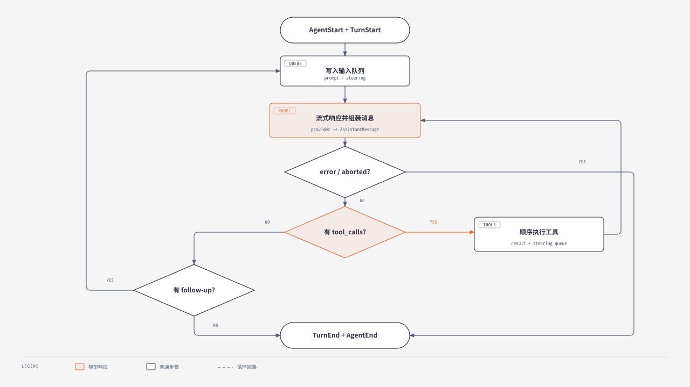

# 03 - Agent Harness、Agent Loop 与事件模型

## 最小内核是什么

Tau 的 Agent 核心可以压缩成：

```text
状态容器 AgentHarness
  + 纯控制流 run_agent_loop()
  + ModelProvider Protocol
  + AgentTool[]
  + AgentEvent stream
```

模型没有“直接调用 Python 函数”。模型输出结构化 `ToolCall`，loop 查表执行对应 `AgentTool`，把 `ToolResultMessage` 追加到上下文，再调用模型继续生成。

## `AgentHarness`：有状态的可复用脑

[`harness.py`](https://github.com/huggingface/tau/blob/c66fb879c1058f7b3d8514fb7f92c919d3c3e3b3/src/tau_agent/harness.py) 中的状态包括：

| 状态 | 用途 |
|---|---|
| `_messages` | 当前可复用会话消息 |
| `_listeners` | push-based event 监听器，持久化等逻辑可订阅 |
| `_current_signal` | 当前运行的取消 token |
| `_running` | 防止同一 Harness 并发进入两次 prompt |
| `_steering_queue` | 当前 run 的下一轮模型请求前插入 |
| `_follow_up_queue` | 当前 run 本应结束后再开始处理 |

### 入口 API

- `prompt(content)`：把新 user message 加入一次 run；
- `continue_()`：不加新 prompt，继续已有上下文；
- `steer()`：在 run 中追加指导；
- `follow_up()`：排队等待当前任务自然完成；
- `cancel()`：设置 cooperative cancellation 标记；
- `subscribe()`：注册事件监听器并返回 unsubscribe 闭包。

`_ensure_not_running()` 会拒绝第二个同步运行，错误提示要求调用 steering/follow-up。这使单个 Harness 的消息数组不存在两个 loop 同时修改的竞争。

## Harness 对中断历史的修复

工具调用可能已经由 assistant 发出，但用户在工具结果返回前取消。如果下一次把“无 tool result 的 tool call”交回 provider，许多 API 会拒绝这段历史。

[`_append_interrupted_tool_results()`](https://github.com/huggingface/tau/blob/c66fb879c1058f7b3d8514fb7f92c919d3c3e3b3/src/tau_agent/harness.py) 会扫描未配对 call，并补：

```text
Tool call interrupted by user
is_error = true
```

修复消息也走 `MessageStartEvent/MessageEndEvent`，因此 push listener 能将它持久化，而不是只修内存。

## `run_agent_loop()` 的真实控制流

[`loop.py`](https://github.com/huggingface/tau/blob/c66fb879c1058f7b3d8514fb7f92c919d3c3e3b3/src/tau_agent/loop.py)：



[在浏览器中打开完整 HTML](diagrams/tau-agent-loop-flow.html)

> [!note] 图表说明
> 使用 `diagram-design` 默认风格重新绘制；流式响应与消息组装合并为一个模型步骤，工具结果追加与 steering 读取合并为工具执行步骤，循环语义保持不变。

### 每一轮发生的事

1. 发出 turn start；
2. 将 pending user/steering message 写入 `messages` 和 `new_messages`；
3. 用 `_provider_context()` 清理不可重放失败并修复 tool history；
4. 订阅 provider 的 assistant stream；
5. 将 provider 事件提升为 message start/update/end；
6. assistant message 持久加入历史；
7. 若有 calls，逐个执行并收集 results；
8. 发出 turn end；
9. steering 使内层循环继续，follow-up 使外层循环重开；
10. 没有 call 和排队消息时 agent end。

## 事件分两层

### Provider/assistant stream events

Provider adapter 输出更细的 assistant message 组装事件：

- assistant start/done/error；
- text start/delta/end；
- thinking start/delta/end；
- tool call start/delta/end；
- retry 等 provider-specific 过程经统一形式上报。

### Agent events

[`events.py`](https://github.com/huggingface/tau/blob/c66fb879c1058f7b3d8514fb7f92c919d3c3e3b3/src/tau_agent/events.py) 定义：

| 事件 | 语义 |
|---|---|
| `AgentStartEvent` / `AgentEndEvent` | 一次完整 run |
| `TurnStartEvent` / `TurnEndEvent` | 一次 model response + 对应工具结果 |
| `MessageStart/Update/EndEvent` | 消息流式生命周期 |
| `ToolExecutionStart/Update/EndEvent` | 本地工具生命周期 |

> [!important] 为什么需要两层
> provider stream 关心如何把供应商碎片组装成 canonical assistant message；agent event 关心“用户看到的 run/turn/message/tool 生命周期”。两者混在一起，会让 UI 和核心都被 OpenAI/Anthropic 的 wire detail 污染。

## Tool 执行细节

`_execute_tool_call()` 的主要失败路径：

- 未知 tool name → structured error result；
- `before_tool_call` 拒绝 → 错误 result；
- 参数准备/执行抛异常 → 捕获并转成错误 result；
- `after_tool_call` 可修改 result 和 error 状态；
- `on_update` 可产生进度事件；
- 结束后同时发 `ToolExecutionEndEvent` 与 `ToolResultMessage` 生命周期事件。

因此 loop 的输出不是“只给最终字符串”，而是完整的可观测状态机。

## Steering 与 follow-up 的区别

| 行为 | 插入时机 | 使用场景 |
|---|---|---|
| steering | 当前 assistant/tool turn 结束后的下一次 provider 请求前 | “先别重构，先补测试” |
| follow-up | 当前 run 已无工具调用、本应结束时 | “完成后再解释改了什么” |

默认 `queue_mode="one_at_a_time"`，每次只 drain 一个；设为 `all` 才一次性取完整队列。

## 取消是 cooperative，不是强制终止一切

Harness 的 token 只是布尔标记：

- provider stream 需要主动检查；
- tool executor 需要主动传递/检查；
- Bash tool 额外负责终止 subprocess/process group；
- finally 中补齐 dangling tool calls。

### 分析与判断

这是合理的 portable contract，但自定义工具若忽略 `signal`，取消响应可能很慢。Extension 作者必须把取消传播到网络请求和子进程。

## 当前并发局限

`AgentTool.execution_mode` 类型支持 `"sequential" | "parallel"`，默认值甚至是 `parallel`；但 [`loop.py`](https://github.com/huggingface/tau/blob/c66fb879c1058f7b3d8514fb7f92c919d3c3e3b3/src/tau_agent/loop.py) 仍是：

```python
for call in calls:
    async for event in _execute_tool_call(...):
        ...
```

因此固定快照中的工具执行是**串行**的，`execution_mode` 没有参与 loop 调度。Provider 可以流出多个并行 tool calls，但本地执行仍逐个完成。

> [!warning] 不要把类型字段当成已实现调度
> 这是典型的源码分析陷阱：schema 表达了设计空间，不代表执行器已经消费它。

## v0.4.5 的响应计时

`run_agent_loop()` 把 provider 等待时间记录到最终 `AssistantMessage.timing`：`total_duration_ms` 是总时长；只有观察到输出事件时才填 `time_to_first_output_ms`。它是诊断元数据，不改变消息、工具和事件的控制流。对照 [loop.py](https://github.com/huggingface/tau/blob/c66fb879c1058f7b3d8514fb7f92c919d3c3e3b3/src/tau_agent/loop.py)、[messages.py](https://github.com/huggingface/tau/blob/c66fb879c1058f7b3d8514fb7f92c919d3c3e3b3/src/tau_agent/messages.py) 与 `tests/test_agent_loop.py::test_agent_loop_does_not_invent_ttft_without_an_output_event`。

## 可迁移的最小实现

自己写 harness 时，最先保留：

1. canonical message union；
2. provider-neutral stream interface；
3. tool name → executor 映射；
4. model → tools → results → model 循环；
5. event stream；
6. dangling tool result repair；
7. deterministic fake-provider tests。

TUI、OAuth、branch、extension 都可后加。

## 导航

- 上一章：[[02 - 三层架构、依赖方向与启动链路]]
- 下一章：[[04 - Provider 适配、消息协议与流式处理]]
- 总览：[[Tau Coding Agent 源码分析 MOC]]
