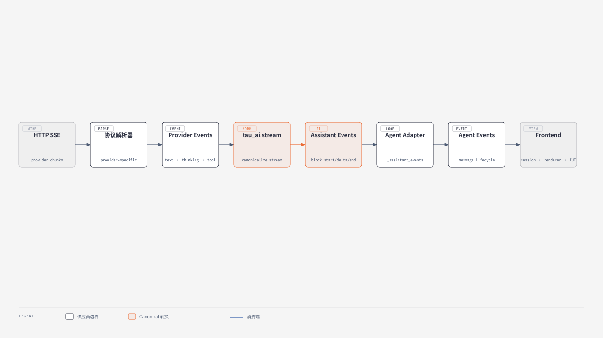

# 04 - Provider 适配、消息协议与流式处理

## Provider 层解决的不是“发 HTTP”这么简单

不同供应商在这些方面都不一致：

- system prompt 放置方式；
- message/content block 结构；
- reasoning/thinking 字段；
- tool schema 与 tool call id；
- SSE/event stream 格式；
- token usage、cache usage、cost metadata；
- stop reason 与错误；
- OAuth/API key、重试语义；
- image input；
- 历史工具调用的合法形状。

Tau 把差异吸收在 `tau_ai`，让 loop 只理解 canonical messages/events。

## 核心协议

[`ModelProvider`](https://github.com/huggingface/tau/blob/c66fb879c1058f7b3d8514fb7f92c919d3c3e3b3/src/tau_agent/provider.py) 只有一个方法：

```python
def stream_response(
    *, model, system, messages, tools,
    signal=None, session_id=None
) -> AsyncIterator[AssistantMessageEvent]: ...
```

`session_id` 不参与 Agent 逻辑，但 provider 可将其用于 sticky routing 或 prompt-cache affinity。

## Canonical message 模型

[`messages.py`](https://github.com/huggingface/tau/blob/c66fb879c1058f7b3d8514fb7f92c919d3c3e3b3/src/tau_agent/messages.py) 使用 Pydantic discriminated union：

| role | 主要内容 |
|---|---|
| `user` | text/image blocks |
| `assistant` | 按顺序排列的 text、thinking、tool call blocks，usage、stop reason、diagnostic |
| `toolResult` | tool call id/name、text/image result、details、error 状态 |
| `bashExecution` | 用户直接 `!`/`!!` 执行的命令记录 |
| `custom` | app/extension-owned message |
| `branchSummary` | 分支回归摘要 |
| `compactionSummary` | 压缩摘要与压缩前 token 数 |

Assistant 的 `content` 不是“文本字段 + 另一个 tool_calls 数组”，而是有序 block 列表；`tool_calls` property 只是从 blocks 中投影。这能保留模型输出的 text/thinking/tool 顺序。

## Provider 构造：配置与运行时分开

### Durable config

`tau_coding/provider_config.py` 将用户级 catalog metadata、运行时偏好和凭证合并。`~/.tau/catalog.toml` 主要描述：

- provider kind、base URL、model list/default；
- API protocol；
- credential name/env；
- context window/max output；
- thinking levels/parameter mapping；
- image support、pricing/cache config。

请求 headers、timeout、retry 等运行时偏好放在 `~/.tau/providers.json`；保存的密钥在 credential store，环境变量是另一种来源。v0.4.5 用户可用 `/login custom`、`tau setup` 或手写 catalog 添加 OpenAI 兼容 provider，无需先改源码。官方 [Adding a custom / local provider](https://github.com/huggingface/tau/blob/c66fb879c1058f7b3d8514fb7f92c919d3c3e3b3/website/content/guides/providers-and-models.md) 给出了三条路径。

### Runtime factory

[`create_model_provider()`](https://github.com/huggingface/tau/blob/c66fb879c1058f7b3d8514fb7f92c919d3c3e3b3/src/tau_coding/provider_runtime.py) 将配置变为：

- `AnthropicProvider`；
- `OpenAICodexProvider`；
- `OpenAICompatibleProvider`；
- 当 compatible config 的 `api` 指定时，改用 `GoogleGenerativeAIProvider`、`MistralConversationsProvider` 或 Anthropic Messages adapter。

这解释了为什么“增加模型”常只改 catalog，而“增加 wire protocol”必须写 adapter。

## 双阶段流式转换



[在浏览器中打开完整 HTML](diagrams/tau-provider-event-pipeline.html)

> [!note] 图表说明
> 使用 `diagram-design` 默认风格重新绘制；橙色节点标记跨 Provider 的 canonical 转换层。

### 为什么需要 block start/delta/end

UI 不能只拿 token delta：它还要知道当前 delta 属于 text、thinking 还是哪个 tool arguments block，以及一个 block 何时结束。Tau 在 channel 切换时先结束 active block，再开始新 block，从而保持顺序和可渲染性。

## Provider adapter 的职责样例

| Adapter | 特殊点 |
|---|---|
| OpenAI-compatible | Chat Completions/Responses 兼容、tool args 增量、model alias、通用网关 |
| OpenAI Codex | subscription OAuth、Responses 风格、reasoning effort、account id、tool call 顺序 |
| Anthropic | Messages API、thinking blocks、cache control、OAuth/system prompt、stream retry |
| Google | Generative AI 的 content/parts 与工具格式映射 |
| Mistral | Conversations API 结构映射 |

Provider adapters 最终都不得把自己的 wire model 泄漏给 loop。

## Tool call ID 与历史修复

不同 provider 对 tool call id 的长度、字符集和跨 turn 稳定性要求不同。Tau 有专门的 `tool_call_ids.py` 与 `tool_history.py`：

- 将内部 call/result 对齐；
- 在发请求前修复缺失、重复或顺序异常的历史；
- 对失败/取消但空内容的 assistant turn 不做 provider replay；
- durable history 仍保留诊断信息。

[`_provider_context()`](https://github.com/huggingface/tau/blob/c66fb879c1058f7b3d8514fb7f92c919d3c3e3b3/src/tau_agent/loop.py) 体现了“记录历史”和“发给模型的可重放上下文”并非同一个集合。

## 重试与错误传播

### 源码事实

- provider 层负责 HTTP/status/stream 错误分类与 backoff；
- provider error 最终转成带 `stop_reason="error"` 的 `AssistantMessage`；
- loop 在 error/aborted 后结束 run，不继续执行 tool；
- 错误 message 可以持久化并展示诊断路径；
- 下一次 prompt 可继续，空失败 turn 会从 provider context 排除。

### 分析与判断

“错误也是消息/事件”比直接抛到 UI 更适合 durable agent：用户能看到失败发生在哪一轮，session export 保留证据，而下一次恢复不会因非法历史永久损坏。

## OAuth refresh 的竞争处理

[`provider_runtime.py`](https://github.com/huggingface/tau/blob/c66fb879c1058f7b3d8514fb7f92c919d3c3e3b3/src/tau_coding/provider_runtime.py) 按 event loop 和 credential name 缓存 `asyncio.Lock`。原因是 refresh token 可能使用后立即轮换；agent loop 与自动命名等任务若同时刷新，同一个旧 token 会被重复消费。

锁内重新读取 credential store，确保等待者看到前一个任务写回的新 token。这是从 demo Agent 走向真实产品时很容易漏掉的并发细节。

## Prompt cache 与 usage

Tau 的消息协议保留：

- input/output/cache read/cache write token；
- cost breakdown；
- provider-reported usage；
- session 级 cache affinity metadata。

应用层将“当前 active context 估计”和“累计 session usage/cost”分开：压缩后前者下降，后者仍累积。这避免把账单 token 和下一次请求的上下文大小混为一谈。

## 如何新增 Provider

### 只新增兼容模型/网关

优先用 `/login custom` 或 `tau setup`；需可版本化的自定义目录时再写用户级 `catalog.toml`。若 wire protocol 已兼容，不必改 loop。进程内**动态 provider** 是 extension API 的另一条路径，生命周期归扩展 runtime，不写入持久 catalog；见 `src/tau_coding/extensions/provider_registry.py`。

### 新增协议

1. 实现 HTTP request 与 stream parser；
2. 映射 canonical `AgentMessage`/`AgentTool` 到 provider payload；
3. 将 provider chunks 映射为统一 assistant events；
4. 处理 tool call id、usage、thinking、images、stop reason；
5. 在 runtime factory 增加构造分支；
6. 用 fake/chunk fixtures 覆盖跨 provider history、并行 tool call ordering、错误与 retry。

## 边界评价

### 优点

- Protocol 小，核心不随 provider 数量膨胀；
- canonical message 是单一事实源；
- 流式事件保留足够 UI 信息；
- catalog 数据化降低模型更新成本；
- 错误、usage、cache 和 OAuth 已考虑真实运行问题。

### 代价

- adapter 的 payload/stream 代码仍复杂且高度 provider-specific；
- “OpenAI-compatible”并不意味着完全兼容，仍需 capability/config 分支；
- provider 快速变化使测试 fixtures 与 catalog 维护成本高；
- canonical protocol 若要兼容所有供应商，长期可能变得越来越宽。

## 导航

- 上一章：[[03 - Agent Harness、Agent Loop 与事件模型]]
- 下一章：[[05 - 工具系统、系统提示词与上下文资源]]
- 总览：[[Tau Coding Agent 源码分析 MOC]]
