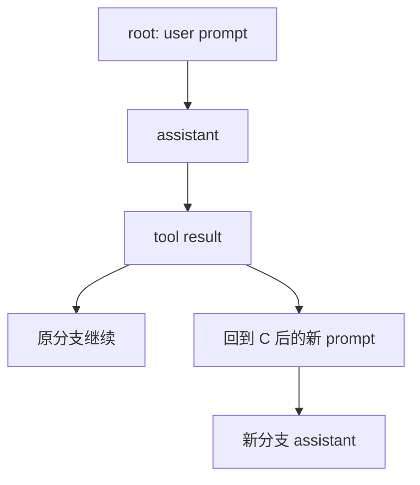

# 06 - Session、分支、恢复与上下文压缩

## 核心结论：Session 是 event log 的投影

Tau 没有在保存时反复覆盖一个 `messages.json`。它把每次变化写成一行 UTF-8 JSONL entry：

```text
append-only entries
      ↓
按 parent_id 选择 root-to-leaf path
      ↓
SessionState.from_entries()
      ↓
当前 messages / model / thinking / label / compaction / custom state
```

这使历史可检查、分支无需复制整份记录、compaction 也无需删除旧消息。

## Entry 模型

[`entries.py`](https://github.com/huggingface/tau/blob/20aafadc7cb0d86e0ad917a74dc2ad4450a94c9e/src/tau_agent/session/entries.py) 中所有 entry 都有：

```text
id: unique entry id
parent_id: previous tree node or null
timestamp: Unix timestamp
type: discriminant
```

| Entry | 作用 |
|---|---|
| `MessageEntry` | user/assistant/tool/custom 等消息 |
| `ModelChangeEntry` | 当前模型变化 |
| `ThinkingLevelChangeEntry` | reasoning/thinking 档位变化 |
| `CompactionEntry` | 摘要 + 被替换 message entry ids |
| `BranchSummaryEntry` | 从其他分支返回时注入的摘要 |
| `LabelEntry` | 人类可读 session 名称 |
| `LeafEntry` | 指定 active branch leaf |
| `SessionInfoEntry` | created_at、cwd、title |
| `CustomEntry` | extension/app 的 namespaced JSON data |

> [!note] `LeafEntry` 是指针记录
> 它不复制分支内容；`entry_id` 指向某个 tree node。恢复时沿该 node 的 `parent_id` 一直回溯到 root，再反转为 active path。

## JSONL 存储

[`JsonlSessionStorage`](https://github.com/huggingface/tau/blob/20aafadc7cb0d86e0ad917a74dc2ad4450a94c9e/src/tau_agent/session/storage.py#L24-L42)：

- append 前自动创建父目录；
- `open("a", encoding="utf-8")` 追加一行；
- read 时缺失文件视为空 session；
- 明确按 `"\n"` 切分，而不用 `splitlines()`，避免 JSON string 中 U+2028 被误切。

默认路径形如：

```text
~/.tau/sessions/<cleaned-project-path>-<short-hash>/...
```

具体文件布局由 `SessionManager` 维护，用户通过 `tau sessions`、`--session`、`/resume` 访问，不应自行假设文件名稳定。

## 持久化迁移边界

[`jsonl.py#L45-L109`](https://github.com/huggingface/tau/blob/20aafadc7cb0d86e0ad917a74dc2ad4450a94c9e/src/tau_agent/session/jsonl.py#L45-L109) 会在反序列化时迁移旧 Tau-v1 message：

- 旧 custom user role → canonical `custom`；
- assistant string content/tool_calls → ordered blocks；
- tool role → `toolResult`；
- usage 缺 cost 时补默认结构；
- legacy snake_case/camelCase 字段归一。

迁移只发生在 persistence boundary，运行时 constructor 和 extension API 仍保持单一严格协议。

### 分析与判断

这是很好的兼容策略：把历史脏数据隔离在读取边界，避免整个应用到处判断 v1/v2。但迁移测试必须长期保留，否则用户多年 session 可能在升级后无法恢复。

## 从 Entry 构造当前状态

[`SessionState.from_entries()`](https://github.com/huggingface/tau/blob/20aafadc7cb0d86e0ad917a74dc2ad4450a94c9e/src/tau_agent/session/memory.py#L36-L103) 有两种模式：

- 不给 leaf：按 storage order 线性 replay；
- 给 leaf id：先 `path_to_entry()` 得到 root-to-leaf，再 replay。

Replay 规则：

- message → 追加到 message rows；
- model/thinking/label → 后写覆盖前写；
- custom/compaction → 收集；
- compaction → 对当前 message rows 做投影替换；
- branch summary → 变为提供给模型的 user summary message。

## Session tree 的合法性

[`tree.py`](https://github.com/huggingface/tau/blob/20aafadc7cb0d86e0ad917a74dc2ad4450a94c9e/src/tau_agent/session/tree.py) 检查：

- entry id 不可重复；
- leaf 必须存在；
- parent chain 不可出现环；
- parent 缺失时报错。

树路径算法本质上是：

```python
while current_id is not None:
    reject_cycle_or_missing()
    path.append(entry)
    current_id = entry.parent_id
path.reverse()
```

## 写入为什么是 push-based

Harness 的 event listener 在 consumer 之外收到每个 event。`CodingSession` 可在 message end 时把 entry 追加到 storage，而不是依赖 UI/print renderer 正常消费到最后。

这在取消场景尤其重要：async iterator consumer 可能已经退出，但 Harness finally 仍可通知 listener，把 synthetic interrupted tool results 落盘。

### 分析与判断

如果持久化只写在 `async for event` 的 UI 循环中，用户取消或前端异常会留下损坏历史。Tau 将 persistence 绑定到 push listener，是核心可靠性设计之一。

## 分支如何发生

用户在 `/tree` 中选择历史 node 后，应用将 active leaf 指回该节点。后续新 entry 的 parent_id 从选定 node 继续，因此自然形成 sibling branch。



原分支 D 没有删除；active leaf 决定恢复和模型上下文看到哪条路径。

## Compaction：改变上下文，不改变历史

`CompactionEntry` 保存：

- `summary`；
- `replaces_entry_ids`；
- 自身 id/parent/timestamp。

[`_apply_compaction()`](https://github.com/huggingface/tau/blob/20aafadc7cb0d86e0ad917a74dc2ad4450a94c9e/src/tau_agent/session/memory.py#L106-L129) 重建 active messages 时：

1. 遍历 message rows；
2. 未被替换者保留；
3. 第一次遇到 replaced id 时插入一条 `Previous conversation summary:` user message；
4. 后续 replaced ids 不再加入；
5. 原始 JSONL entries 保持不变。

> [!important] 压缩不是删除
> `/compact` 减少下一次模型请求的 active context，但 export/session tree 仍能保留完整原历史。累计 usage 也不会因压缩“倒退”。

## 自动压缩与溢出恢复

`CodingSession` 结合：

- provider/model context limit；
- provider-reported usage；
- local token estimate；
- auto-compaction threshold；
- context overflow error detection

决定是否先总结旧上下文再重试。压缩本身仍需要一次模型调用，因此超出窗口太多或 provider 不可用时也可能失败。

## Auto session naming

Tau 可在会话初期另起 provider 请求生成简短标题。源码中特别处理 OAuth refresh lock，因为 agent 主 loop 和命名任务可能同时发请求。

这也提示一个通用原则：辅助 LLM 调用（命名、总结、评测）不是主 loop 的“无成本附属物”，它们会竞争 token、credential refresh、rate limit 与网络资源。

## Session 模型的优点

- append-only，便于诊断与导出；
- branch 是树指针，不用复制大历史；
- compaction 可逆地改变 active projection；
- model/thinking/label/custom data 与消息一起形成事件历史；
- 可恢复 interrupted tool history；
- migration 集中在 persistence boundary。

## 局限与风险

### 分析与判断

- 单文件 JSONL 缺少数据库事务、索引和跨进程写锁；
- append 不是 `fsync` 保证，进程/磁盘异常可能留下尾部损坏行；
- tree replay 对长链是线性回溯；大量 session 的索引由应用层额外维护；
- compaction summary 会丢细节，完整历史仍在磁盘不等于模型仍能使用它；
- 摘要由模型生成，事实错误可能进入后续 context；
- session JSONL 不持久化 live system prompt，离线 export 无法完全复现当时请求；live HTML 可附带 prompt，但分享前有泄露风险。

## 导航

- 上一章：[[05 - 工具系统、系统提示词与上下文资源]]
- 下一章：[[07 - Extensions、CLI、TUI 与前端边界]]
- 总览：[[Tau Coding Agent 源码分析 MOC]]
