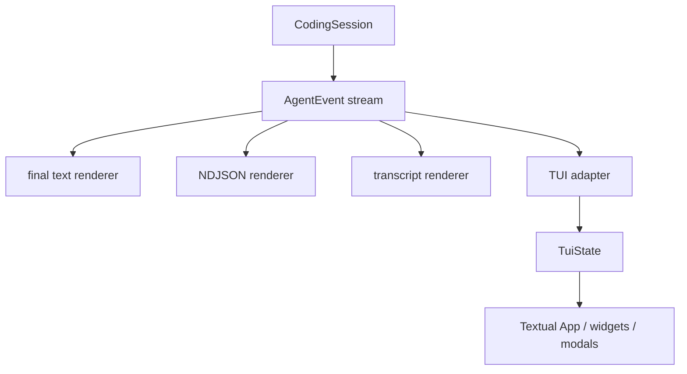
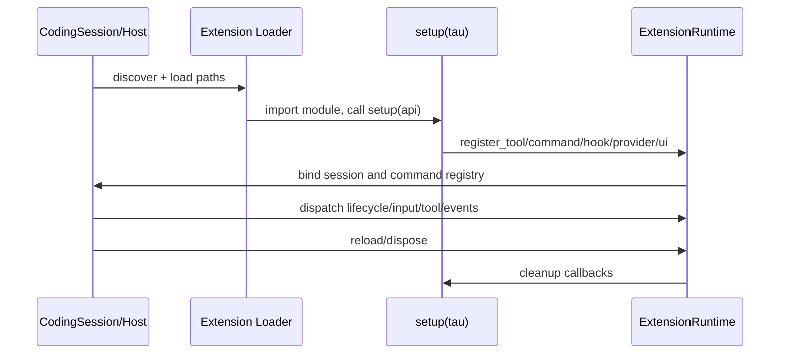

# 07 - Extensions、CLI、TUI 与前端边界

## 产品层如何围绕同一个核心生长

Tau 不为 TUI 写第二套 Agent loop。CLI print mode、Textual TUI、自定义 frontend 都消费同一 `AgentEvent`，差别只是状态投影和交互能力。

## CLI：不仅是参数解析

`tau_coding/cli.py` 是外层组合与模式路由：

- 规范 stdout/stderr UTF-8；
- 处理 `tau`、`--print`、`--mode json/transcript`；
- sessions、export、providers、setup、update；
- cwd、model、thinking、system prompt；
- extensions 与 project extensions；
- project trust 的 ask/approve/decline；
- print/TUI 的 provider/session 构造与关闭。

### Print mode 的用途

- 脚本调用；
- CI 或一次性 repo 问答；
- text：只输出最终可见文本；
- JSON：逐事件输出，适合程序消费；
- transcript：保留较完整的人类可读过程。

若要将 Tau 嵌入别的前端，JSON event mode 与 library-level Harness 都比解析 ANSI TUI 更合适。

## Slash command registry

`commands.py` 将 `/help`、`/model`、`/compact`、`/tree` 等注册为 `SlashCommand`：

- name/aliases/description；
- argument metadata；
- sync handler；
- registry 负责 parse、duplicate detection、dispatch；
- 未知 slash input 可继续作为普通 prompt，而不是一定报错。

Extension command 与内置 command 最终都接入相同 registry/dispatch 路径。

## TUI adapter：事件到显示状态

Textual 不直接操纵 Harness 消息数组。Adapter 的职责是：

- Agent/turn 开始结束 → running/status；
- assistant delta → 更新当前 streaming item；
- tool start/update/end → 建立/更新 tool row；
- 多个相邻 built-in call → 仅在显示层做 batch/group；
- usage/context → sidebar；
- error/cancel → transcript block；
- restored session → 重新投影已有消息。

[`TuiEventAdapter.apply()`](https://github.com/huggingface/tau/blob/20aafadc7cb0d86e0ad917a74dc2ad4450a94c9e/src/tau_coding/tui/adapter.py#L35-L149) 是实时路径的边界：delta 先形成临时显示，`MessageEndEvent` 到达后再用最终 canonical `AssistantMessage` 重建该段，确保 block 顺序与持久化消息一致。恢复路径则由 [`TuiState.load_messages()`](https://github.com/huggingface/tau/blob/20aafadc7cb0d86e0ad917a74dc2ad4450a94c9e/src/tau_coding/tui/state.py#L628-L685) 从已有消息重新投影。

> [!note] UI batching 不等于执行并发
> TUI 可把一组 read/edit/write 显示为紧凑块，但 docs 明确说明 grouping 只影响展示；执行、session history 和 print transcript 仍保留每个 call/result。

## `20aafad`：跨 response 的 edit/write 分组

旧快照只需要理解“同一个 assistant message 内的相邻调用可分组”。当前 commit 进一步允许连续 assistant responses 合并，但规则很窄：

1. 当前消息必须只含工具调用，不能夹带 text/thinking；
2. 这些调用必须全部同名，且只能是 `edit` 或 `write`；
3. 上一个显示项必须是同类工具，已获得 result，且自己允许 continuation；
4. 不能跨自定义 tool-call renderer 合并；
5. `read` 仍只在单个 assistant message 的 batch 内分组。

实时路径在 [`adapter.py#L71-L127`](https://github.com/huggingface/tau/blob/20aafadc7cb0d86e0ad917a74dc2ad4450a94c9e/src/tau_coding/tui/adapter.py#L71-L127) 为满足条件的 call 记录 continuation 标记；[`TuiState._can_append_file_mutation_continuation()`](https://github.com/huggingface/tau/blob/20aafadc7cb0d86e0ad917a74dc2ad4450a94c9e/src/tau_coding/tui/state.py#L289-L318) 决定是否并入上一显示组。恢复路径用同一个 [`_is_file_mutation_only_message()`](https://github.com/huggingface/tau/blob/20aafadc7cb0d86e0ad917a74dc2ad4450a94c9e/src/tau_coding/tui/state.py#L707-L715) 判定，因此 live 与 restored transcript 应一致。

对应回归测试明确覆盖：连续五次 write、连续三次 edit 会合并；插入 assistant text/thinking、换工具类型、失败/未完成结果或自定义 renderer 会阻断合并。展开显示仍可查看每个 call/result（[`tests/test_tui_adapter.py#L265-L391`](https://github.com/huggingface/tau/blob/20aafadc7cb0d86e0ad917a74dc2ad4450a94c9e/tests/test_tui_adapter.py#L265-L391)）。

> [!important] 架构含义
> `AssistantMessage → ToolResultMessage → AssistantMessage` 的 canonical 边界没有被折叠；折叠发生在 `ChatItem`/`GroupedToolCall`。因此这是 display projection 的演进，不是 Agent loop、tool scheduler 或 session schema 的改变。

## `TuiState` 为什么值得单独存在

状态层缓存：

- `ChatItem[]`；
- tool call id → display item；
- current streaming assistant；
- run/turn 状态；
- context、usage、cost、cache；
- tools/skills/prompts/extensions/context files；
- display-only group/batch ids。

这样 Textual widget 可以重挂载、分页、折叠或换主题，而不改变 durable session 或 Agent core。

## 长会话 UI 窗口化

TUI 只 mount transcript 的一个窗口，滚动到边界再分页。完整 display state 和 durable history 仍保留。

窗口化与 compaction 是两件事：

- 窗口化：减少 Textual DOM/widget 压力；
- compaction：减少下一次发送给模型的 token。

这是前端性能和模型上下文经常被混淆的两个维度。

## Extension 系统的装载流程

### 发现来源

官方文档与 loader 支持：

- user extensions：`~/.tau/extensions/`；
- 显式 `-e/--extension PATH`；
- project extensions：项目目录中的扩展，但必须额外启用 `--project-extensions` 且通过 project trust。

目录可包含 Python file/package；loader 为每次加载生成独立模块名，收集 import/setup diagnostics，并在 reload 时卸载相关模块。

### 生命周期

`CodingSession.load()` 先加载用户级和显式 extensions，再做 project trust；只有 trusted 且启用 `--project-extensions` 才加载项目扩展。随后 [`ExtensionRuntime.compose_tools()`](https://github.com/huggingface/tau/blob/20aafadc7cb0d86e0ad917a74dc2ad4450a94c9e/src/tau_coding/extensions/runtime.py#L629-L645) 合并工具：扩展同名工具在原位置覆盖 built-in，扩展独有工具按注册顺序追加，最后统一包裹 `tool_call/tool_result` hook seam。组装位置见 [`session.py#L452-L490`](https://github.com/huggingface/tau/blob/20aafadc7cb0d86e0ad917a74dc2ad4450a94c9e/src/tau_coding/session.py#L452-L490)。

## Extension 能扩展什么

### 源码事实

Extension API 可以注册或参与：

- custom tools；
- slash commands；
- lifecycle/session/model/input hooks；
- `tool_call` / `tool_result` hooks；
- event subscriptions；
- provider/OAuth/catalog 相关扩展点；
- tool call/result custom renderer；
- TUI component bridge、key interceptor；
- custom session entries；
- diagnostics 与 cleanup。

工具注册后会包装成 core `AgentTool`，hook 通过 Harness 的 before/after seam 接入，避免 core 反向 import extension runtime。

## Extension generation 与 reload

Reload 时旧 extension instance 的 API 不能继续修改新 runtime。源码用 generation/disposed 状态检测 stale API，先清 UI components、运行 cleanup、清 registry、卸载模块，再加载新 generation。

### 分析与判断

这比简单的 `importlib.import_module()` 成熟：热重载最大的坑不是“能重新 import”，而是旧回调、widget、闭包和命令仍挂在 host 上。Generation guard 能把此类幽灵注册暴露成错误。

## Extension 安全边界

Python extension 是本机代码，不是 declarative plugin：

- import 时即可执行代码；
- 可访问进程权限下的文件、网络、环境变量；
- project trust 只在加载前提供一层输入决策；
- project extension 还需显式 `--project-extensions`，但启用后并无进程级隔离。

只安装审查过的 user extension；不要把未知仓库的 extension 当成普通 Markdown skill。

## Roadmap 与当前源码的冲突

[Roadmap issue #1](https://github.com/huggingface/tau/issues/1) 在 2026-07-09 的更新中仍显示 “Phase 21 — Extensions” 未勾选，但：

- `src/tau_coding/extensions/` 已包含 api/loader/runtime；
- `tests/test_extensions.py` 与 example extension tests 存在；
- 官网已有 Extensions guide；
- release notes 已记录 Python extensions；
- v0.3.10 还将 Hugging Face route controls 移到 public extension API。

因此 Roadmap 只能作为演进历史，不能作为 2026-08-17 固定快照的功能真值。

## 自定义 Frontend 的最小方法

1. 创建 concrete provider 与 tools；
2. 构造 `AgentHarness` 或 `CodingSession`；
3. `async for event in prompt()`；
4. 维护自己的 UI state projection；
5. 对 message/tool lifecycle 做增量渲染；
6. 需要持久化、commands、resources 时优先使用 `CodingSession`；只要最小脑时使用 Harness。

不要让 frontend 直接拼 provider payload 或自己重复 tool loop，否则会丢失 Tau 的协议边界。

## 设计评价

### 优点

- 同一 event contract 支撑多个 renderer；
- TUI state 与 durable state 分开；
- UI grouping 不污染 session；
- Extension 注册面较完整，且有 cleanup/generation；
- project extension 需要 trust + explicit enable 两道门。

### 代价

- Extension API 面已经很宽，0.x 阶段兼容成本高；
- `CodingSession`、TUI app、ExtensionRuntime 之间绑定点多；
- command handler 仍是 sync-only，异步扩展命令需绕到其他 seam；
- Python extension 是完全信任代码，没有 capability sandbox；
- TUI 功能丰富后，adapter/state/widgets 本身已形成第二个复杂子系统。

## 导航

- 上一章：[[06 - Session、分支、恢复与上下文压缩]]
- 下一章：[[08 - 安全边界、测试体系、局限与设计评价]]
- 总览：[[Tau Coding Agent 源码分析 MOC]]
