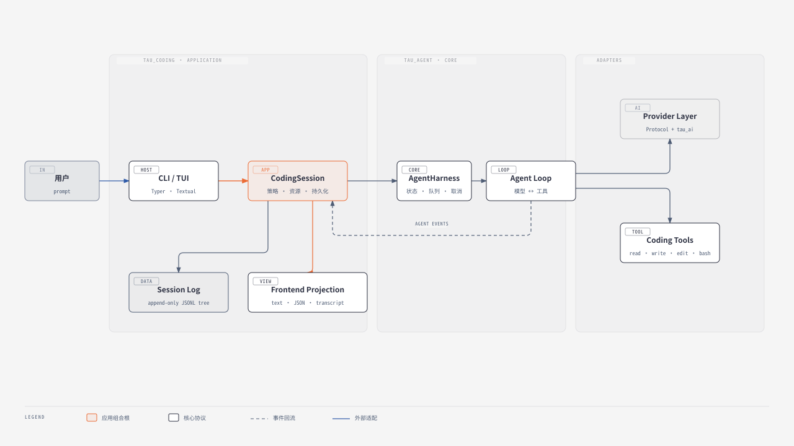

# Tau Coding Agent 源码分析 MOC

> [!abstract] 一句话结论
> [Tau](https://github.com/huggingface/tau) 是一个 **Python 3.12+、Pi 风格、终端优先**的 coding agent。它最值得学习的不是“又一个聊天 CLI”，而是如何用 `Provider Protocol → Agent Loop → Harness → CodingSession → Frontend` 将模型适配、Agent 核心、应用策略和 UI 拆开。

## 阅读基线

| 项目 | 本次分析采用的事实 |
|---|---|
| 仓库 | [huggingface/tau](https://github.com/huggingface/tau) |
| 源码快照 | [`c66fb879`](https://github.com/huggingface/tau/tree/c66fb879c1058f7b3d8514fb7f92c919d3c3e3b3)（2026-09-23，项目版本 0.4.5） |
| Git describe | `v0.4.5-2-gc66fb87` |
| 主语言 | Python，不是 TypeScript |
| Python 要求 | `>=3.12` |
| UI | Typer CLI + Textual TUI + Rich/JSON/Transcript 渲染 |
| License | MIT |
| 仓库快照 | 工作树干净；450 个 tracked files；198 个 Python 文件；69 个测试文件 |
| 本地验证 | `TZ=UTC`：2011 passed、2 skipped；默认本机时区一项固定日期断言失败；Ruff lint/format 与 mypy 均通过 |

> [!warning] 分析范围
> 结论以固定 commit 为准。Tau 更新很快，GitHub Roadmap、README 和当前源码可能不同步；例如 issue #1 的 Extensions 状态已不能代表 v0.4.5 的实际扩展能力。官网可能在此 commit 之后继续变化。

## 建议阅读顺序

如果以动手学习为目标，先看 [[Tau Coding Agent 深度学习计划]]，按模块的练习和过关标准推进。

1. [[源码分析/Tau Coding Agent/01 - 项目定位、技术栈与源码地图]]：先确认它是什么、不是什么。
2. [[02 - 三层架构、依赖方向与启动链路]]：理解真实依赖与一次请求如何进入核心。
3. [[03 - Agent Harness、Agent Loop 与事件模型]]：阅读最小 Agent 内核。
4. [[04 - Provider 适配、消息协议与流式处理]]：看不同模型 API 如何收敛成统一事件。
5. [[05 - 工具系统、系统提示词与上下文资源]]：看 coding 能力如何装配进核心。
6. [[06 - Session、分支、恢复与上下文压缩]]：理解“可恢复、可分支、可压缩但不改历史”。
7. [[07 - Extensions、CLI、TUI 与前端边界]]：理解产品层和二次开发接口。
8. [[08 - 安全边界、测试体系、局限与设计评价]]：最后看边界、欠账和可迁移经验。
9. [[Tau 源码索引与参考资料]]：按文件、主题和证据类型快速回查。

## 核心架构图

[在浏览器中打开完整 HTML](diagrams/tau-core-architecture.html)

> [!note] 图表说明
> 使用 `diagram-design` 默认风格重新绘制；HTML 是设计源，SVG 用于 Obsidian 内嵌。为满足架构图的视觉预算，Provider 协议与具体适配器、工具协议与内置工具分别合并展示。

## 六个必须抓住的源码结论

1. **`AgentHarness` 不是整个 coding agent。** 它只拥有可复用的“脑”：消息、运行状态、取消、steering/follow-up 队列与事件监听。
2. **`CodingSession` 才是 coding-agent 环境。** 系统提示词、项目资源、扩展、命令、持久化、压缩、模型切换都在应用层编排。
3. **事件是核心边界。** Provider 先输出 assistant stream events，Loop 再提升为 agent events；TUI 和 print renderer 消费同一套事件，不进入核心反向控制业务。
4. **Session 是日志加投影，不是可变聊天数组。** JSONL 只追加；`parent_id` 组成树，默认取文件顺序最后一个非旧式 `leaf` entry 作为 tip，`SessionState.from_entries()` 投影出当前上下文。旧 `LeafEntry` 只用于兼容读取。
5. **Project trust 不是 sandbox。** 它只决定是否读取项目里的指令、skills、prompts、themes、system prompt 和已显式允许的 extensions；文件、进程、网络与 Bash 权限没有因此被隔离。
6. **TUI 是 canonical history 的显示投影。** 连续、仅含同类 `edit` 或 `write` 的 assistant responses 可合成一组，但工具调用、结果和持久化边界仍逐条存在。v0.4.5 还新增动态 provider、models.dev 目录和本地后端，属于应用工程层。

## 适合如何学习

> [!tip] 推荐源码路径
> `pyproject.toml` → `tau_coding/cli.py` → `tau_coding/session.py` → `tau_agent/harness.py` → `tau_agent/loop.py` → `tau_agent/events.py` → `tau_agent/provider.py` → `tau_ai/*` → `tau_coding/tools.py` → `tau_agent/session/*`。

如果目标是自己写 Agent，建议先复刻 `tau_agent` 的小内核，再逐层加入：

- fake provider 与确定性测试；
- 一个真实 provider adapter；
- 一到两个 typed tool；
- append-only session；
- CLI renderer；
- 最后才是 TUI、扩展与 OAuth。

## 与库内现有资料的关系

- 相关视频整理：[[Clippings/Bilibili/Tau：学习 Agent 架构]]。
- 本目录以固定 commit 的源码和官方文档为主；视频内容仅作为二级材料，不替代源码证据。

## 证据标记

- **源码事实**：直接来自固定 commit 中的代码、测试或配置。
- **官方文档**：README、官网、Roadmap、Release、ADR；可能晚于或早于代码。
- **外部资料**：Pi 等上游/参照项目资料。
- **分析与判断**：基于上述事实做出的工程评价，不冒充作者声明。
